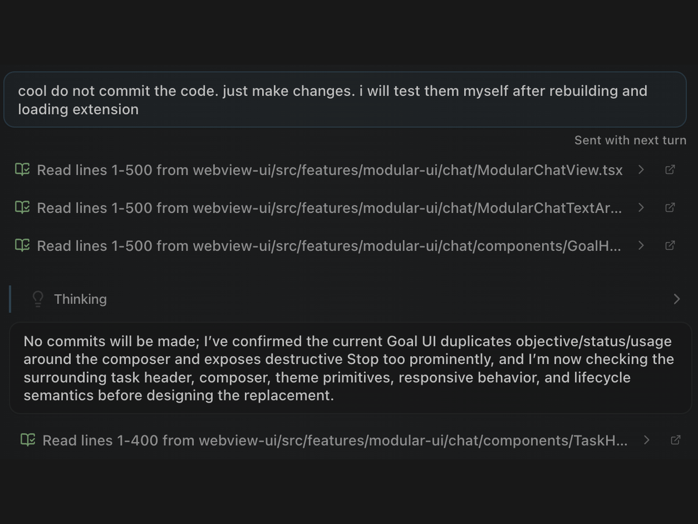

# Continuous steering

Send new direction at any point during a Goal or regular coding task without cancelling the work in progress. Dirac applies it at the next safe boundary and continues with the updated instructions.

