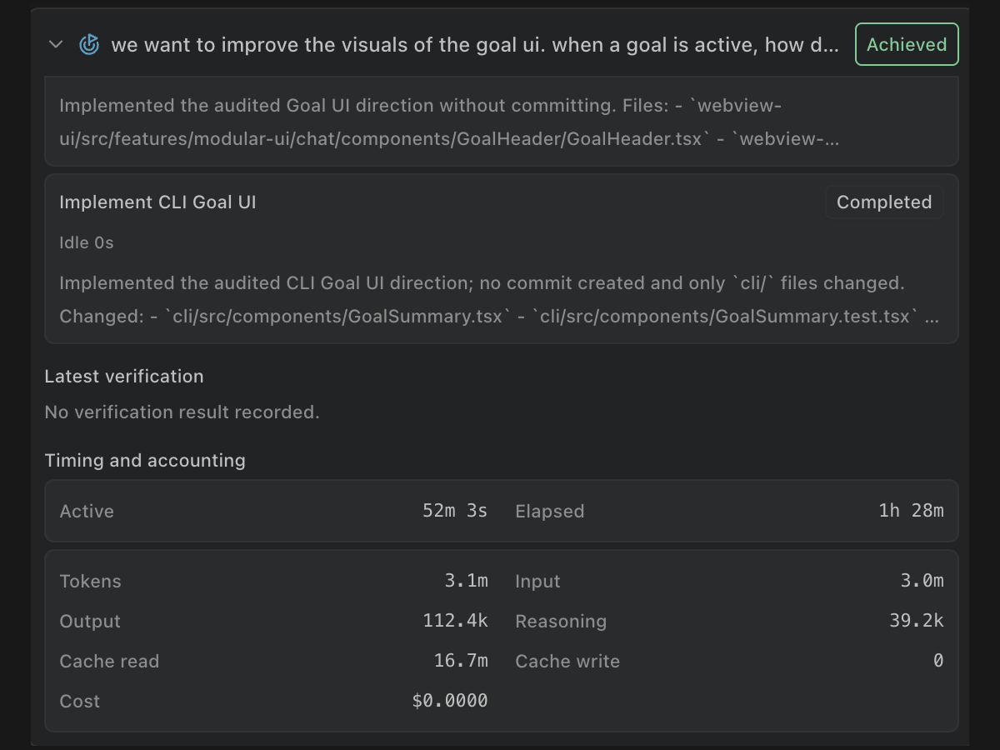

# Give Dirac a Goal, walk away

Leave the session running and Dirac can work toward the same goal for hours or days without drifting. Check in and steer it whenever you want. It continues until the goal is achieved, paused, or stopped.

