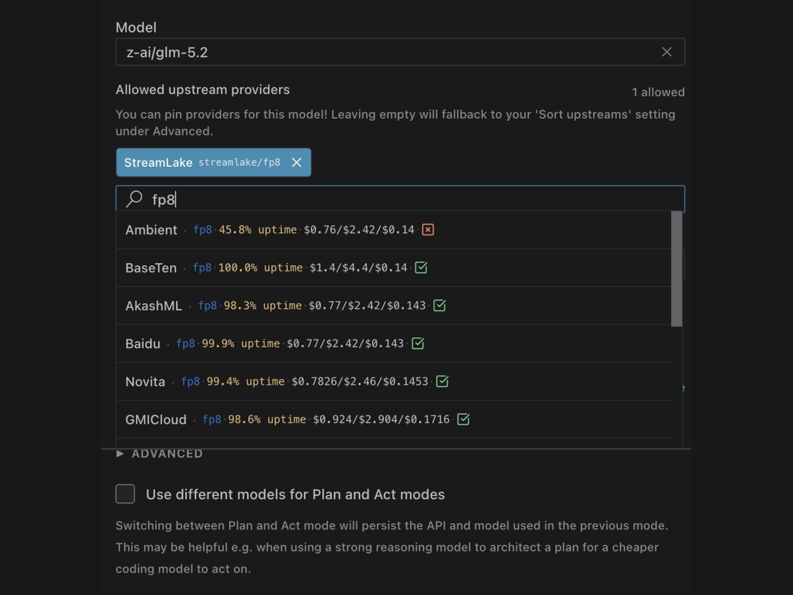

# Choose from hundreds of models across dozens of providers

Use different models for different jobs and let Dirac coordinate them. You could use OpenAI for planning, GLM for coding, and DeepSeek for permission decisions, all working together on the same task.

