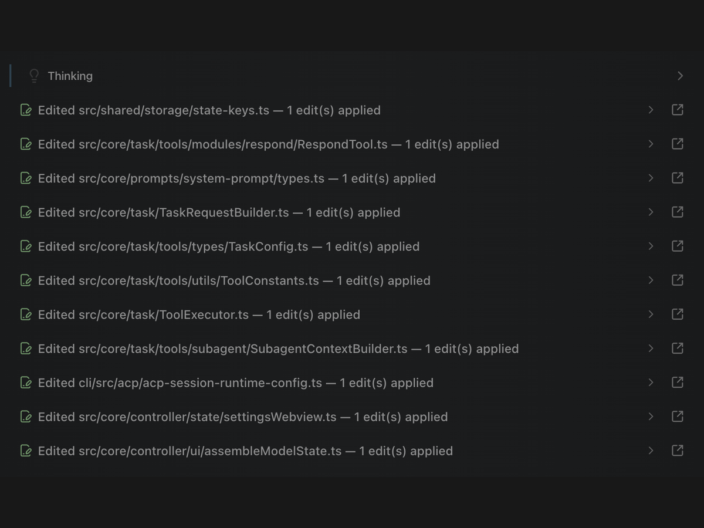

# Get work done a lot faster

Dirac pushes independent reads, searches, edits, commands, and coding work to happen together whenever they safely can. This removes the serial back and forth that makes agent tasks slow.

