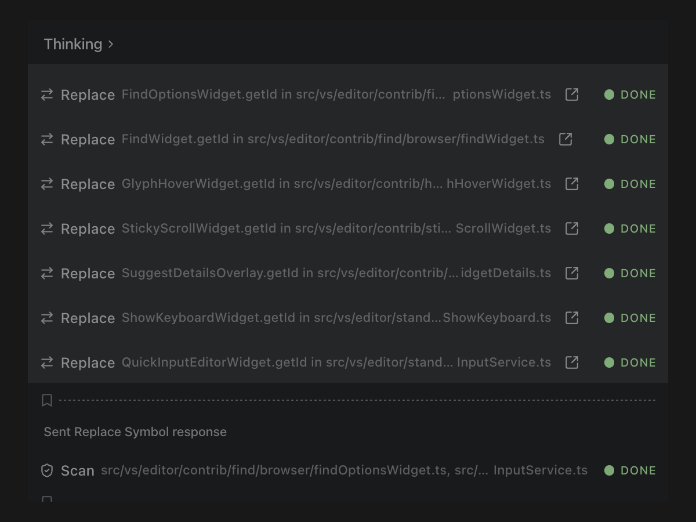

# Make precise changes in large codebases

Hash-anchored edits stay attached to the intended source even when nearby code moves. AST-based understanding lets Dirac follow definitions and references and make structural changes without guessing.

[See how Dirac's hash anchors work](https://dirac.run/posts/hash-anchors-myers-diff-single-token)

