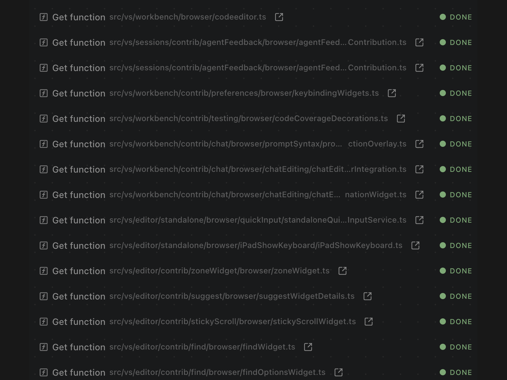

# Obsessively optimized for token efficiency

Dirac is designed to minimize context, output, and repeated model calls while keeping the relevant code, constraints, and validation intact. Tokens go toward the work instead of agent overhead.

