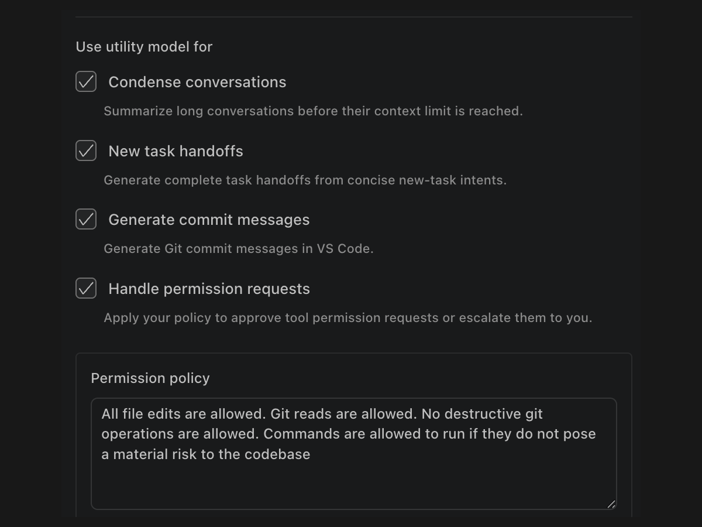

# No permission fatigue

A separate Utility model can clear routine, low-risk permission requests while hard safety rules remain in control. It can also compact long task context with a more cost-effective model, reducing interruptions and cost while the main model stays focused on the code.

[Read about model arbitrage for context compaction](https://dirac.run/posts/token-arbitrage-sol-vs-luna)

